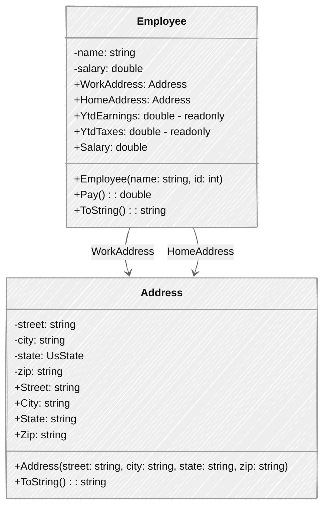

## Overview
Implement an object-oriented design using classes.

| | |
| --------- | --------------------------- |
| Exercise Folder | Classes |
| Builds On | None |
| Time to complete | 60 minutes| 

### Lab Overview
We will begin building a payroll system for a company.  Our initial design will include an Employee class and an Address class.  

The Employee and Address classes are shown below.



Notes:
- Validate the employee name to
    - Not be null
    - Not be empty
    - Only contain alphabetic characters, spaces, hyphens, periods and apostrophes.
    - Minimum length of 2 characters, maximum length of 50 characters.
- Validate the employee salary to
    - Be greater than or equal to 50.
    - Be less than or equal to 1,000.

- Employee Pay() method:
    - Calculate the taxes withheld from the salary. (7.65%)
    - Increment YtdEarnings by the salary.
    - Increment YtdTaxes by the taxes withheld.
    - Return the net pay.

- Validate Address properties to
    - Not be null
    - Not be empty
    - Minimum length of 2 characters, maximum length of 50 characters.
    - Only alphanumeric characters, spaces, hyphens, periods and apostrophes.
    - Readonly

### Detailed Instructions
1. Create a new console application named *Classes*.
2. Follow the detailed instructions below to create the classes.

#### Unit tests
The following code can be pasted into *Program.cs* to test the classes.  Note the use of the `double` extension method `Is` to compare double values with a tolerance.

Starting with the unit test code below, implement the classes so that the tests pass.  This approach is called Test-Driven Development (TDD).

```csharp
using Payroll;

//Check Address class
var address = new Address("123 Main St", "Anytown", UsState.NY, "12345");
if (address.Street != "123 Main St" || address.City != "Anytown" || address.State != UsState.NY || address.Zip != "12345")
    throw new Exception("Address class is not correct");

try
{
    new Address("123 <Main> St", "Anytown", UsState.NY, "12345");
    throw new Exception("Address class is not correctly validating street address");
}
catch (ArgumentException) { }

try
{
    new Address("123 Main St", "Any$$own", UsState.NY, "12345");
    throw new Exception("Address class is not correctly validating city");
}
catch (ArgumentException) { }

try
{
    new Address("123 Main St", "Anytown", UsState.NY, "1234");
    throw new Exception("Address class is not correctly validating zip code");
}
catch (ArgumentException) { }

//Check Employee class

// valid employee
var employee = new Employee("John Doe", 100);
employee.WorkAddress = new Address("123 Main St", "Anytown", UsState.AZ, "12345");
employee.HomeAddress = new Address("456 Elm St", "Othertown", UsState.CA, "67890");

if (employee.Name != "John Doe" || employee.Salary != 100)
    throw new Exception("Employee name or salary is not correct");

var net = employee.Pay(); 
if (net != 92.35 || !employee.YtdEarnings.Is(100) || !employee.YtdTax.Is(7.65))
    throw new Exception("Employee Pay is not correct");

// invalid employees
try
{
    var bad = new Employee("John$ Doe", 500);
    throw new Exception("Employee class is not correct - name did not fail validation");
} catch (ArgumentException) { }

try
{
    var bad = new Employee("John Doe", 5000);
    throw new Exception("Employee class is not correct - salary did not fail validation");
} catch (ArgumentException) { }

Console.WriteLine("All tests pass!");

static class DoubleExtensions
{
    public static bool Is(this double value, double target, double tolerance = 0.0001) 
        => Math.Abs(value - target) < tolerance;
}
```    


#### *Address* Detailed Instructions

1. Create a new class named *Address*.
2. Declare the namespace `Payroll` at the top of the file. (use file-scoped namespace)
3. Create an `enum` named *UsState*.  You can grab the list of states below.

```AL, AK, AZ, AR, CA, CO, CT, DE, FL, GA, HI, ID, IL, IN, IA, KS, KY, LA, ME, MD, MA, MI, MN, MS, MO, MT, NE, NV, NH, NJ, NM, NY, NC, ND, OH, OK, OR, PA, RI, SC, SD, TN, TX, UT, VT, VA, WA, WV, WI, WY```

4. Add the following auto properties to the *Address* class (use get/init):
    - Street
    - City
    - State
    - Zip
5. Add a constructor that initializes the properties from arguments.
    - Validate the properties in the constructor.  Use the regular expression `"^[a-zA-Z0-9\s.'-]{2,50}$"` for street and city. (hint: use the `Regex` class)
    - The state field does not need validation as all possible *UsState* values are valid.
    - The zip field should be validated with the regular expression `@"^\d{5}(-\d{4})?$"`.
    - Throw an `ArgumentException` if any property is invalid.

#### *Employee* Detailed Instructions
1. Create a new class named *Employee*.
2. Declare the namespace `Payroll` at the top of the file. (use file-scoped namespace)
3. Add a field for the employee name and salary.
4. Add a constructor that accepts name and salary
    - initialize the `Name` and `Salary` properties.
5. Add a property for the employee name.
    - The property should validate the name using the regular expression `"^[a-zA-Z\s.'-]{2,50}$"`.
    - The property should throw an `ArgumentException` if the name is invalid.
6. Add a property for the employee salary.
    - The property should validate the salary is greater than or equal to 50 and less than or equal to 1,000.
    - The property should throw an `ArgumentException` if the salary is invalid.
7. Add auto properties for HomeAddress and WorkAddress.
8. Add a property for YtdEarnings and YtdTaxes.
    - The properties should have private setters.
9. Add a method named Pay() that calculates the net pay.
    - Calculate the taxes withheld from the salary. (7.65%)
    - Increment YtdEarnings by the salary.
    - Increment YtdTaxes by the taxes withheld.
    - Return the net pay.

