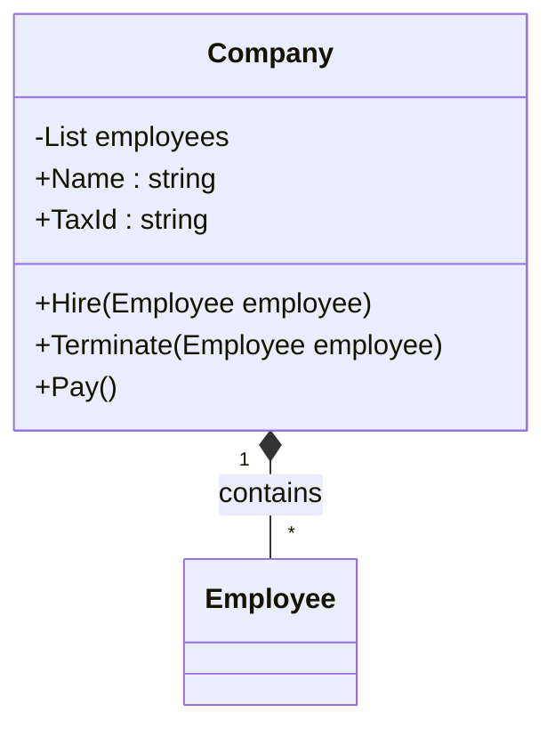

## Overview
Add a *Company* class to the payroll system.  The Company class will contain a list of employees and provide methods to add and remove employees.

| | |
| --------- | --------------------------- |
| Exercise Folder | Collections |
| Builds On | AdvancedClasses |
| Time to complete | 30 minutes| 

---

> **Note** This lab is a continuation of the AdvancedClasses lab.  If you have not completed the AdvancedClasses lab, use the [AdvancedClasses Solution](../AdvancedClasses/Solution/) as the starting point for this lab.


### Lab Overview
A company has a name, tax id, and many employees.  A company can hire, terminate, and pay employees.




### Instructions
- Create a new console application, or continue with the AdvancedClasses console application.
#### Unit Tests
1. Add the following code to *Program.cs* to test the Company class (put it near the bottom, right before `Console.WriteLine("All tests pass!");`).  Of course, the code will have errors until you create the Company class.

```csharp
var comp = new Company("Acme", "12-1234567");
comp.Hire(employee);
comp.Hire(employee2);
comp.Hire(new Employee("Jane Doe", 200));
net = comp.Pay();
if (!net.Is (92.35 + 92.35 + 184.70))
    throw new Exception("Company Pay is not correct");
comp.Terminate(employee);
net = comp.Pay();
if (!net.Is(92.35 + 184.70))
    throw new Exception("Company Pay is not correct after termination");
```

---

#### Create the Company Class

2. Create a new class called `Company`.
3. Add the following properties to the `Company` class:
    - `Name` (string)
    - `TaxId` (string)
    - `Employees` (List<Employee>)
4. Add a constructor that accepts the `Name` and `TaxId` as parameters.
    - initialize the `Employees` list in the constructor or inline
5. Add a method called `Hire` that accepts an `Employee` as a parameter and adds the employee to the `Employees` list.
6. Add a method called `Terminate` that accepts an `Employee` as a parameter and removes the employee from the `Employees` list.
7. Add a method called `Pay` that pays all employees.
    - Return the total net pay for all employees.