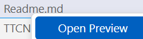

# Course Labs for TTCN20483 - Creating Apps in C# and .Net Core

[Course Outline](https://www.triveratech.com/course?code=TTCN20483)

When using VSCode, view .md files by right-clicking on the file and selecting "Open Preview".

## Labs
Labs are organized in subfolders of the *Labs* folder.  Each folder contains a `Readme.md` file that describes the lab and provides instructions.  Each lab folder contains a *Solution* folder that contains the Visual Studio solution for the lab.

All labs are part of the same overall solution (TTCN20483Labs.sln)[./TTCN20483Labs.sln] file.  This allows you to work on multiple labs at the same time.  In VSCode, just open this folder and you will have access to all labs.

In Visual Studio, open the solution file to access all labs.

## Examples
*Examples* contains source code and notebooks that demonstrates various features.  See the [Readme.md](./Examples/Readme.md) file for more information.

## License
This project is licensed under the MIT License - see the [LICENSE.md](LICENSE.md) file for details